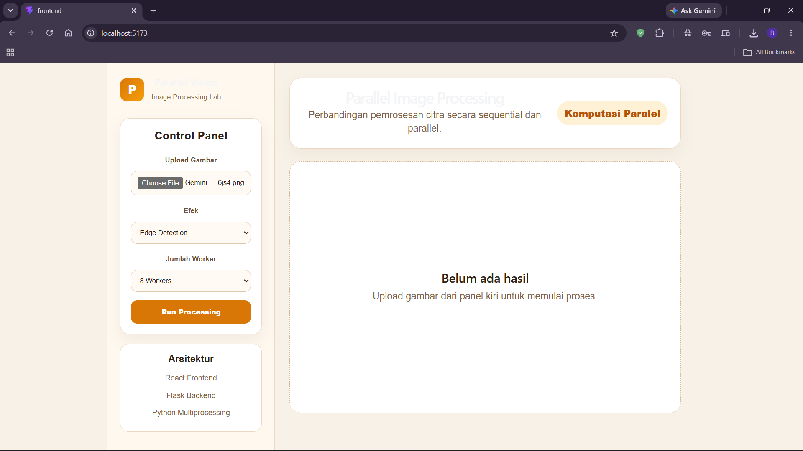
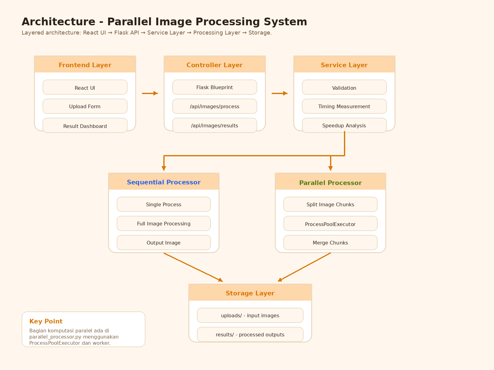
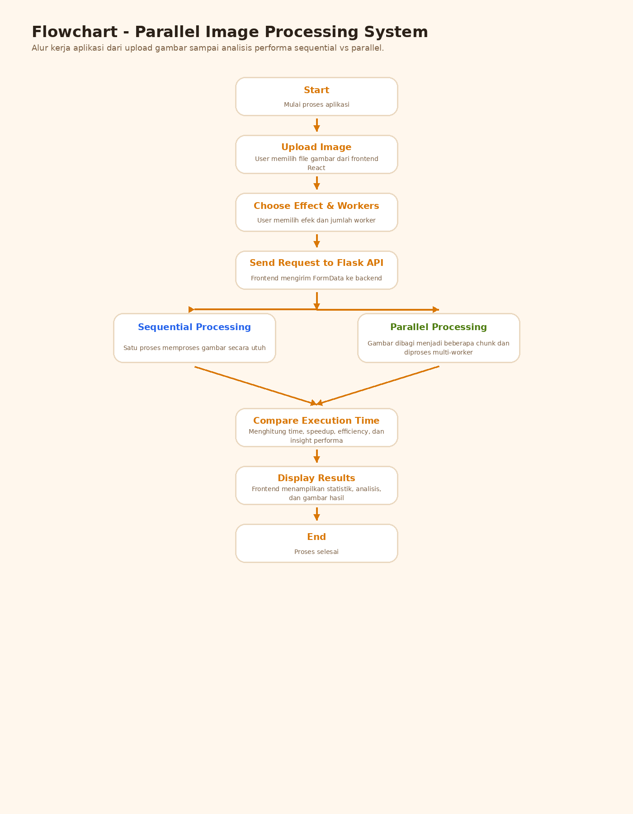

# Parallel Image Processing System

## Overview

Parallel Image Processing System adalah aplikasi berbasis web yang dikembangkan untuk mengimplementasikan dan menganalisis konsep Komputasi Paralel pada pemrosesan citra digital.

Aplikasi ini membandingkan dua metode pemrosesan gambar:

* Sequential Processing (pemrosesan berurutan)
* Parallel Processing (pemrosesan paralel)

Sistem dibangun menggunakan React sebagai frontend, Flask sebagai backend, serta Python Multiprocessing untuk implementasi komputasi paralel.

---

## Background

Pemrosesan citra digital merupakan salah satu bidang yang banyak digunakan dalam berbagai sektor, seperti:

* Computer Vision
* Artificial Intelligence
* Medical Imaging
* Smart Transportation
* Industrial Automation

Pada data berukuran besar, proses pengolahan citra dapat memerlukan waktu eksekusi yang cukup tinggi. Oleh karena itu, diperlukan pendekatan komputasi paralel untuk membagi beban kerja ke beberapa worker sehingga proses dapat dijalankan secara bersamaan dan lebih efisien.

---

## Objectives

Tujuan utama project ini adalah:

* Mengimplementasikan konsep komputasi paralel menggunakan Python Multiprocessing.
* Membandingkan performa antara Sequential Processing dan Parallel Processing.
* Mengukur execution time, speedup, dan efficiency.
* Menampilkan hasil pengolahan citra secara visual melalui antarmuka web.
* Memberikan analisis performa berdasarkan hasil pengujian.

---

## Dashboard Preview

Berikut merupakan tampilan utama aplikasi Parallel Image Processing System.

Fitur utama yang tersedia pada dashboard:

* Upload gambar
* Pemilihan efek pemrosesan
* Pengaturan jumlah worker
* Analisis performa
* Perbandingan hasil sequential dan parallel



---

## Features

### Image Upload

Pengguna dapat mengunggah file gambar yang akan diproses oleh sistem.

### Image Processing Effects

Sistem menyediakan beberapa metode pemrosesan citra:

* Grayscale
* Blur
* Edge Detection

### Sequential Processing

Gambar diproses menggunakan satu proses secara berurutan tanpa pembagian tugas.

### Parallel Processing

Gambar dibagi menjadi beberapa bagian (chunk) dan diproses secara bersamaan menggunakan beberapa worker.

### Performance Analysis

Sistem secara otomatis menampilkan:

* Sequential Time
* Parallel Time
* Speedup
* Efficiency
* Performance Insight

---

## Technologies Used

### Frontend

* React
* Vite
* Axios

### Backend

* Flask
* Flask-CORS

### Processing

* Python Multiprocessing
* ProcessPoolExecutor
* Pillow (PIL)

### Version Control

* Git
* GitHub

---

## System Architecture



### Architecture Explanation

#### Frontend Layer

Frontend dibangun menggunakan React dan berfungsi untuk:

* Upload gambar
* Memilih efek pemrosesan
* Mengatur jumlah worker
* Menampilkan hasil pemrosesan

#### Controller Layer

Backend Flask menerima request dari frontend dan mengatur komunikasi antar layer.

#### Service Layer

Layer ini bertanggung jawab untuk:

* Validasi data
* Pengaturan alur proses
* Pengukuran performa
* Perhitungan speedup dan efficiency

#### Processing Layer

Terdiri dari dua metode pemrosesan:

* Sequential Processor
* Parallel Processor

#### Storage Layer

Digunakan untuk menyimpan:

* File upload
* Hasil pemrosesan

---

## Flowchart



### Processing Flow

1. User mengunggah gambar.
2. User memilih efek pemrosesan.
3. User menentukan jumlah worker.
4. Frontend mengirim request ke Flask API.
5. Backend menjalankan Sequential Processing.
6. Backend menjalankan Parallel Processing.
7. Sistem menghitung execution time.
8. Sistem menghitung speedup dan efficiency.
9. Hasil ditampilkan kepada pengguna.

---

## Project Structure

```text
parallel-image-processing/

├── backend/
│   ├── processors/
│   │   ├── sequential_processor.py
│   │   └── parallel_processor.py
│   │
│   ├── services/
│   │   └── image_service.py
│   │
│   ├── utils/
│   │   └── file_utils.py
│   │
│   ├── uploads/
│   ├── results/
│   ├── app.py
│   └── requirements.txt
│
├── frontend/
│   ├── src/
│   ├── public/
│   └── package.json
│
├── docs/
│   ├── Dashboard.png
│   ├── architecture.png
│   └── flowchart.png
│
└── README.md
```

---

## Parallel Computing Implementation

Implementasi komputasi paralel berada pada:

```python
backend/processors/parallel_processor.py
```

Menggunakan:

```python
ProcessPoolExecutor
```

Mekanisme kerja:

1. Gambar dibagi menjadi beberapa chunk.
2. Setiap chunk diproses oleh worker yang berbeda.
3. Worker berjalan secara bersamaan menggunakan multiprocessing.
4. Hasil seluruh worker digabung kembali.
5. Waktu eksekusi dibandingkan dengan metode sequential.

---

## Performance Metrics

### Execution Time

Waktu yang diperlukan untuk menyelesaikan proses pemrosesan gambar.

### Speedup

Rumus:

```text
Speedup = Sequential Time / Parallel Time
```

Interpretasi:

* Speedup > 1 → Parallel lebih cepat
* Speedup = 1 → Performa sama
* Speedup < 1 → Parallel lebih lambat

### Efficiency

Rumus:

```text
Efficiency = Speedup / Number of Workers
```

Digunakan untuk mengukur efektivitas penggunaan worker pada sistem paralel.

---

## Running The Application

### Backend

```bash
cd backend
pip install -r requirements.txt
python app.py
```

Backend akan berjalan pada:

```text
http://localhost:5000
```

### Frontend

```bash
cd frontend
npm install
npm run dev
```

Frontend akan berjalan pada:

```text
http://localhost:5173
```

---

## Testing Scenario

Pengujian dilakukan dengan beberapa parameter:

* Gambar resolusi kecil
* Gambar resolusi besar
* Efek Grayscale
* Efek Blur
* Efek Edge Detection
* Worker 2, 4, 6, dan 8

Output yang diamati:

* Execution Time
* Speedup
* Efficiency
* Visual Result Comparison

---

## Future Improvements

Pengembangan yang dapat dilakukan di masa depan:

* Support high-resolution image datasets
* Additional image processing filters
* Real-time monitoring dashboard
* GPU-based parallel processing
* Distributed Computing Implementation
* Cloud Deployment

---

## Author

**Moch Riezky Dwi Kuswanto**

IFB206 – Komputasi Paralel

Program Studi Informatika

Institut Teknologi Nasional Bandung (ITENAS)

2026
